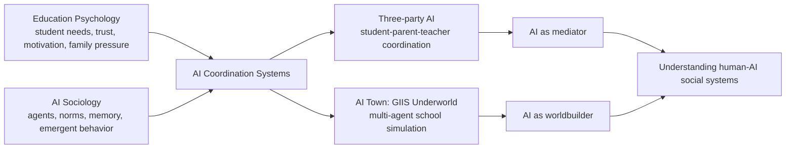
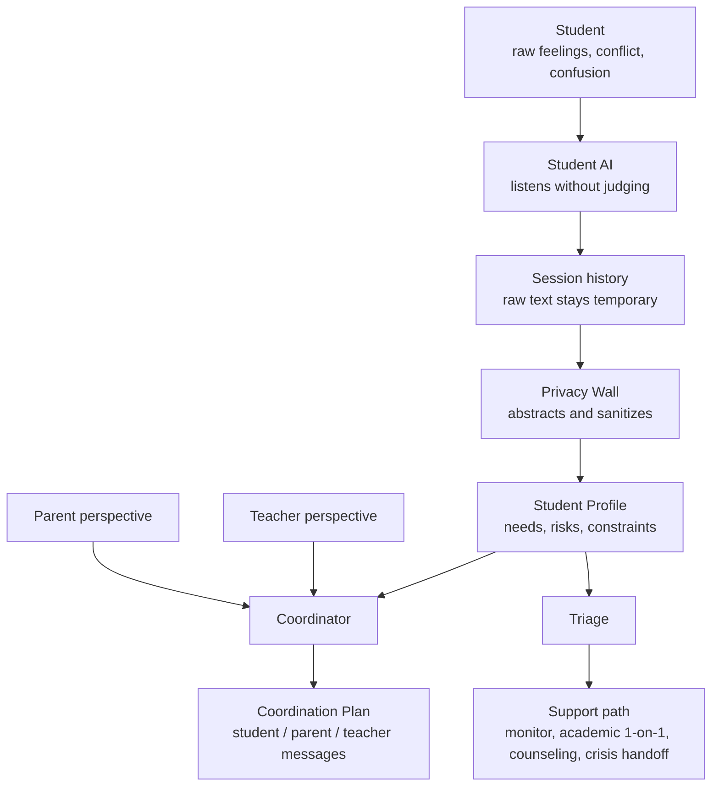
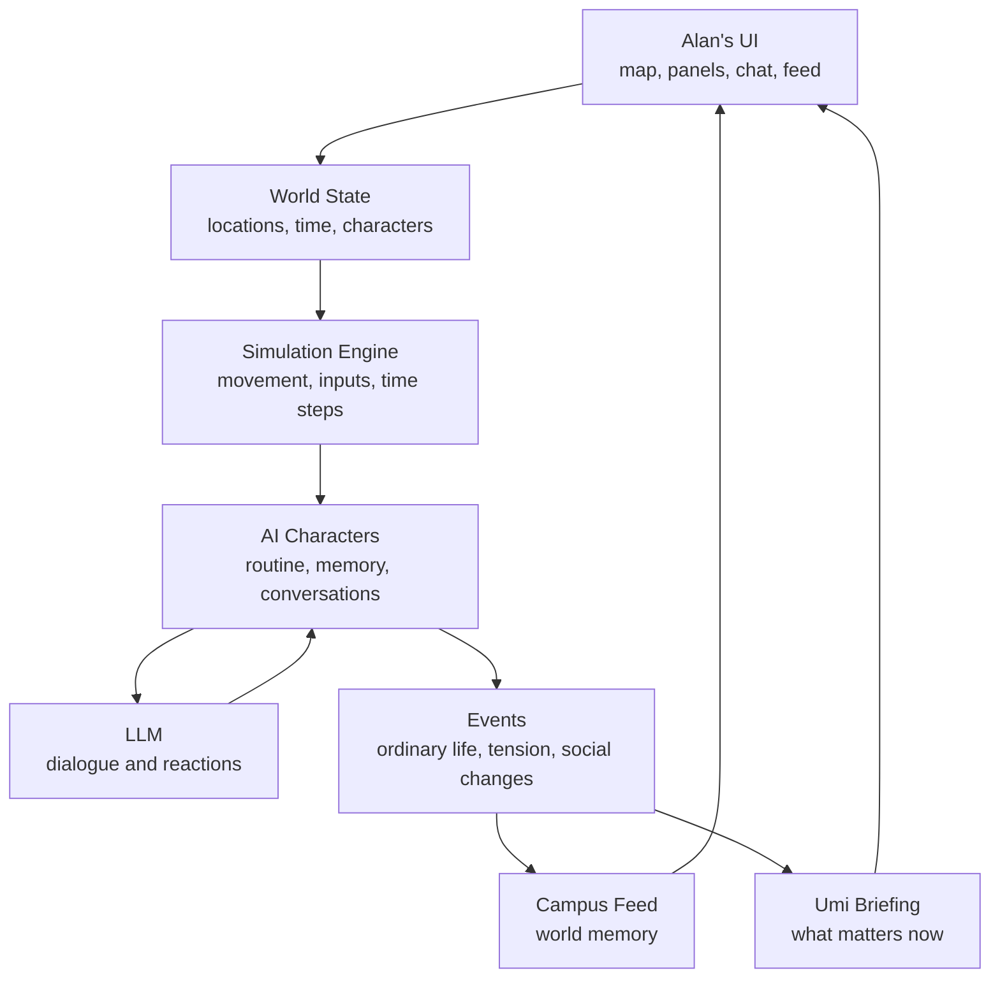
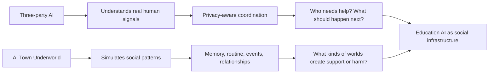
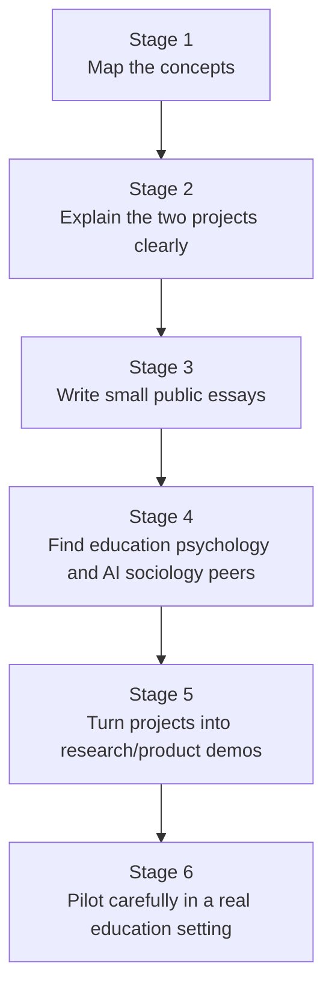

# Exploring AI Sociology Through Education Psychology

I am trying to understand a space that sits between education psychology, AI systems, and social simulation.

The core question is not simply: "Can AI tutor students?"

The question I keep coming back to is:

> What happens when AI becomes part of the social environment where students, parents, teachers, and institutions understand each other?

This document is a working map for that exploration. It is not a finished theory. It is a way to make the project understandable to myself and to people who might want to explore the same space.

## The Core Thesis

AI can play at least two different roles in education:

1. **AI as a coordination layer**
   AI helps different people understand and respond to each other without forcing everyone into the same conversation too early.

2. **AI as a simulated social world**
   AI characters, routines, events, and memories can create a small world where social patterns can be observed, tested, and designed.

The first direction is represented by **Three-party AI**.

The second direction is represented by **AI Town: GIIS Underworld**.

Together, they point toward a broader question:

> Can AI help us model not only individual learning, but the social systems around learning?

## High-Level Map

## Project 1: Three-party AI

Three-party AI starts from a practical education psychology problem:

Students, parents, and teachers often do not see the same reality.

A student may feel pressure, shame, confusion, avoidance, or distrust, but may not say those things directly to parents or teachers. Parents may only see grades, behavior, or silence. Teachers may only see classroom performance. Everyone is looking at fragments.

The product idea is not to make an AI that replaces the teacher or counselor.

It is to create an AI coordination layer that can:

- listen to the student safely
- abstract private information without leaking raw disclosure
- combine student, parent, and teacher perspectives
- suggest a coordination plan
- identify when human support or escalation is needed

### Three-party AI Flow

### Why This Matters

The key insight is that AI may be the first place where a student tells the truth.

That creates responsibility.

If AI hears something real, it cannot simply broadcast it. It must transform raw disclosure into a useful but privacy-respecting signal. This is where education psychology and AI safety meet.

The interesting research/product questions are:

- What makes a student willing to disclose?
- What should AI never pass forward directly?
- How much abstraction is enough to protect privacy but still preserve meaning?
- When should AI escalate to a human?
- How do we avoid making AI a surveillance layer?
- How do we prevent parents and teachers from over-trusting an AI summary?

## Project 2: AI Town: GIIS Underworld

AI Town: GIIS Underworld starts from a different question:

What if education AI is not a tool, but a small social world?

Instead of one student chatting with one assistant, the system has:

- characters
- schedules
- locations
- conversations
- memory
- daily rhythm
- events
- campus feed
- Umi as guide and emotional anchor

This makes the project feel closer to AI sociology.

It is not only asking whether an AI can answer a question. It is asking whether AI agents can create a believable social environment with routines, tensions, memory, and consequences.

### AI Town Flow

### Why This Matters

A school is not only a curriculum.

It is a social system:

- students avoid or approach each other
- teachers notice some signals but miss others
- parents shape incentives from outside the classroom
- rumors and small events matter
- time changes what is possible
- relationships have memory

AI Town is a way to explore these dynamics as a simulation instead of only as a dashboard.

The interesting questions are:

- Can AI agents maintain believable social memory?
- What makes a simulated school feel alive instead of random?
- How do daily routines create trust, avoidance, or conflict?
- Can a simulation reveal coordination problems before they happen in real life?
- Can Umi help reduce decision overload by summarizing the world emotionally and practically?
- What is the line between useful simulation and over-designed fiction?

## How The Two Projects Connect

Three-party AI is closer to the real-world intervention layer.

AI Town is closer to the simulated world / research layer.

The shared theme is:

> AI should not only optimize individual answers. It should help us understand the social conditions around learning.

## Possible Research Lenses

### Education Psychology

Useful concepts to explore:

- trust and disclosure
- student motivation
- learned helplessness
- self-efficacy
- parent-child academic pressure
- teacher perception gaps
- belonging and social safety
- adolescent identity formation

### AI Sociology

Useful concepts to explore:

- agent societies
- emergent norms
- simulated institutions
- memory and social continuity
- role expectations
- coordination failure
- artificial communities
- human-AI social feedback loops

### Human-AI Interaction

Useful concepts to explore:

- when users trust AI too much
- when users refuse AI mediation
- how to design explainable summaries
- how to keep humans in the loop
- how to prevent AI from becoming a surveillance tool
- how to design escalation without panic

## What Kind Of People I Want To Find

I am especially interested in meeting people who care about:

- education psychology
- adolescent development
- learning science
- AI-mediated counseling or student support
- AI safety in human systems
- multi-agent simulation
- AI sociology
- social worldbuilding
- human-AI coordination

I am less interested in AI as a pure productivity tool.

I am more interested in AI as a new layer of social reality.

## Roadmap For Understanding This Space

## Public Writing Ideas

Possible short essays:

1. **AI as the first listener**
   Why students may tell AI things they do not tell adults.

2. **The privacy wall problem**
   Why education AI should not simply summarize student conversations for parents.

3. **From chatbot to coordinator**
   Why the useful unit may be student-parent-teacher systems, not single-user chat.

4. **AI schools as simulated societies**
   What agent worlds can teach us about learning environments.

5. **Umi as guide, not controller**
   How an AI companion can reduce decision overload without taking away agency.

## Current Unanswered Questions

- How do we evaluate whether an AI summary preserves meaning without leaking private truth?
- What should be deterministic, and what should be LLM-generated?
- How do we design escalation without making students feel watched?
- Can simulated school worlds produce useful insights, or do they mainly produce fiction?
- What kinds of agent memory are necessary for believable social continuity?
- How can this become useful to real schools without becoming intrusive?

## Working Identity

I am not trying to build another tutoring chatbot.

I am exploring how AI changes the social layer around education:

- how students disclose
- how adults coordinate
- how institutions notice risk
- how simulated worlds can help us reason about human systems
- how AI companions can reduce overload without controlling the user

This is still early.

But the direction feels important.

